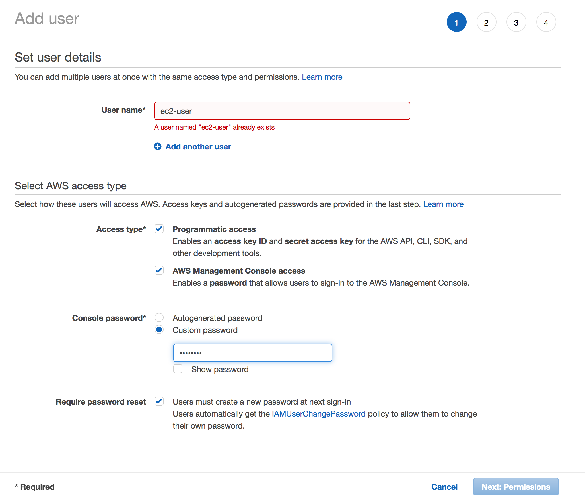
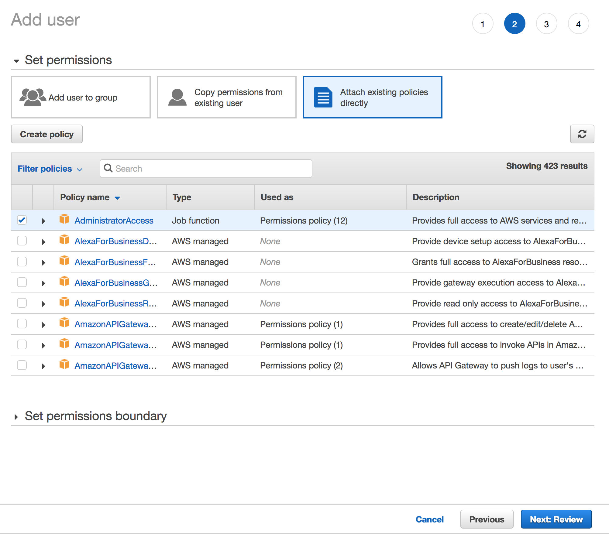

# AWS SSH Bless with BlessClient

In this workshop you will allow users to SSH into an AWS instance without managing SSH Key Pairs.

The application uses [AWS Identity and Access Management (IAM)](https://aws.amazon.com/iam/), [Amazon EC2](https://aws.amazon.com/ec2/), [AWS Lambda](https://aws.amazon.com/lambda/), [AWS Key Management Service](https://aws.amazon.com/kms/), [Amazon S3](https://aws.amazon.com/s3/) and [AWS CloudFormation](https://aws.amazon.com/cloudformation/).

## Prerequisites

### AWS Account

In order to complete this project you will need an AWS Account with access to create AWS IAM, and other AWS resources at an administrator level.

The BLESS project is required and is located here: [Netflix  BLESS](https://github.com/Netflix/bless.git)

Lyft's BLESS client project is required and is located here: [Lyft - BLESS Client](https://github.com/lyft/python-blessclient)

Several of the IAM roles and policies used in this project was referenced from the following tutorial. It is recommend that it is looked over for a further understanding of how the policies work. https://www.tastycidr.net/a-practical-guide-to-deploying-netflixs-bless-certificate-authority/

All of the resources you will launch as part of this workshop are eligible for the AWS free tier if your account is less than 12 months old. See the [AWS Free Tier page](https://aws.amazon.com/free/) for more details.

**WARNING**: This guide is for demonstration purposes only and should be executed with a temporary account user.  Putting AWS Credentials into CloudFormation is potentially dangerous and should be done cautiously.  This demonstration is used to show the functionality of BLESS and BLESS Client.  Normally the Client computer would be a personal workstation and now an EC2 instance.

### Region Selection

This workshop can be deployed in any AWS region that supports the following services:

- AWS KMS
- AWS Lambda
- Amazon EC2
- AWS CloudFormation

You can refer to the [region table](https://aws.amazon.com/about-aws/global-infrastructure/regional-product-services/) in the AWS documentation to see which regions have the supported services.


## Implementation Instructions

Each of the following sections provides an implementation overview and detailed, step-by-step instructions. The overview should provide enough context for you to complete the implementation if you're already familiar with the AWS Management Console or you want to explore the services yourself without following a walk through.

### 1. Create a temporary IAM user.

This demonstration is not intended to be used at a production level and a temporary IAM user should be made before running the CloudFormation template.  

Use the IAM console to create a new user. Name it `ec2-user` and attach an administrator policy to the user.  Bless Client is made to use the same user name on the EC2 instances and the AWS account user name.  Creating a user as described above will simplify the process.

<details>
<summary><strong>Step-by-step instructions (expand for details)</strong></summary><p>

1. From the AWS console, click on *services* and go to **IAM** under *Security, Identity & Compliance*.

2. One the left side of the screen, click **Users** and the click **Add User**.

3. Give the user a name. For this project use `ec2-user` and select both **Programmatic access** and **AWS Management Console access**.  Give the user a password from *Console password* and check *Require password reset* if desired. Click **Next: Permissions**.

	><br/>

<br/>

4. Click **Attach existing Policies Directly** and select **AdministratorAccess**, click **Next: Review**.

	><br/>

<br/>

5.  Click **Create User**, save the *Programmatic access credentials* and log in as the new user.

</p></details>

----

### 2. Launch CloudFormation template.

Launch one of these AWS CloudFormation templates in the Region of your choice.  Ensure that the region has the required resources.  Click on the drop down bellow to get details about what the CloudFormation template does in the background.

**Notice**: Currently this is only working for us-west-2 and us-west-1 regions.  A fix will be added shortly.

Region| Launch
------|-----
US East (N. Virginia) | [](https://console.aws.amazon.com/cloudformation/home?region=us-east-1#/stacks/new?stackName=BLESS&templateURL=https://s3.amazonaws.com/alangixxer-github/aws-ssh-bless-with-blessclient/bless-blessclient.json)
US East (Ohio) | [](https://console.aws.amazon.com/cloudformation/home?region=us-east-2#/stacks/new?stackName=BLESS&templateURL=https://s3.amazonaws.com/alangixxer-github/aws-ssh-bless-with-blessclient/bless-blessclient.json)
US West (Oregon) | [](https://console.aws.amazon.com/cloudformation/home?region=us-west-2#/stacks/new?stackName=BLESS&templateURL=https://s3.amazonaws.com/alangixxer-github/aws-ssh-bless-with-blessclient/bless-blessclient.json)
EU (Frankfurt) | [](https://console.aws.amazon.com/cloudformation/home?region=eu-central-1#/stacks/new?stackName=BLESS&templateURL=https://s3.amazonaws.com/alangixxer-github/aws-ssh-bless-with-blessclient/bless-blessclient.json)
EU (Ireland) | [](https://console.aws.amazon.com/cloudformation/home?region=eu-west-1#/stacks/new?stackName=BLESS&templateURL=https://s3.amazonaws.com/alangixxer-github/aws-ssh-bless-with-blessclient/bless-blessclient.json)
EU (London) | [](https://console.aws.amazon.com/cloudformation/home?region=eu-west-2#/stacks/new?stackName=BLESS&templateURL=https://s3.amazonaws.com/alangixxer-github/aws-ssh-bless-with-blessclient/bless-blessclient.json)
EU (Paris) | [](https://console.aws.amazon.com/cloudformation/home?region=eu-west-3#/stacks/new?stackName=BLESS&templateURL=https://s3.amazonaws.com/alangixxer-github/aws-ssh-bless-with-blessclient/bless-blessclient.json)
Asia Pacific (Tokyo) | [](https://console.aws.amazon.com/cloudformation/home?region=ap-northeast-1#/stacks/new?stackName=BLESS&templateURL=https://s3.amazonaws.com/alangixxer-github/aws-ssh-bless-with-blessclient/bless-blessclient.json)
Asia Pacific (Seoul) | [](https://console.aws.amazon.com/cloudformation/home?region=ap-northeast-2#/stacks/new?stackName=BLESS&templateURL=https://s3.amazonaws.com/alangixxer-github/aws-ssh-bless-with-blessclient/bless-blessclient.json)
Asia Pacific (Sydney) | [](https://console.aws.amazon.com/cloudformation/home?region=ap-southeast-2#/stacks/new?stackName=BLESS&templateURL=https://s3.amazonaws.com/alangixxer-github/aws-ssh-bless-with-blessclient/bless-blessclient.json)
Asia Pacific (Mumbai) | [](https://console.aws.amazon.com/cloudformation/home?region=ap-south-1#/stacks/new?stackName=BLESS&templateURL=https://s3.amazonaws.com/alangixxer-github/aws-ssh-bless-with-blessclient/bless-blessclient.json)

Fill out the ClouFormation paramaters.
<details>
<summary><strong>Step-by-step instructions (expand for details)</strong></summary><p>

1. Fill out the CoudFormation paramaters.

	> **Stack name**: Give a unique name.</br>
	>**ChosenVPC**: Select a VPC where the EC2 instances will be placed.</br>
	> **ChosenSubnet**: Select a Subnet where the EC2 instances will be placed, ensure that they are in the Chosen VPC.</br>
	> **SSHnetwork**: Enter your IP.</br>
	> **VCPCIDR**: Enter your selected VPC CIDR block.</br>
	> **EC2KeyPair**: Pick a Key Pair used to log into the Client EC2.</br>
	> **KeyAlias**: Enter a Key Alias for the KMS key.</br>
	> **KeyPwd**: Enter a password for the created Key Pair.</br>
	> **NewUser**: Select a username to generate a new user.</br>
	> **DeploySecondEC2**: Select True or False to launch a second EC2.</br>
	> **AccessKey**: Enter an AWS Access Key.</br>
	> **SecretAccessKey**: Enter an AWS Secret Access Key.</br>

</br>

 2. Click **Next**.</br>
 3. Add a tag if desired and click **Next**.</br>
 4. Check *I acknowledge that AWS CloudFormation might create IAM resources with custom names.* and click **Create**.

</p></details>

<details>
<summary><strong>Detailed Break Down of the CloudFormation template(expand for details)</strong></summary><p>

1. Two EC2 instances are created.

- The first created instance will take place of a personal laptop (client workstation).  The second instance will serve as "some other box within AWS" to SSH into.  The demonstration is done this way so it can be fully automated from one CloudFormation template.  The EC2 instances have permission to KMS decrypt and write/read to S3 which would not be needed required for normal use.

2. Two IAM roles are created; **BlessLambdaRole** and **BlessInvokeRole.**

- BlessLambdaRole has the following trust relationship.
	```json
	{
	  "Version": "2012-10-17",
	  "Statement": [
	    {
	      "Sid": "",
	      "Effect": "Allow",
	      "Principal": {
	        "AWS": "arn:aws:sts::##########:assumed-role/BLESS-BlessInvokeRole-	1DIUQOETIAT82/mfaassume",
	        "Service": "lambda.amazonaws.com"
	      },
	      "Action": "sts:AssumeRole"
	    }
	  ]
	}
	```

- BlessLambdaRole has the two following attached policies.

	```json
	{
	    "Version": "2012-10-17",
	    "Statement": [
	        {
	            "Action": [
	                "kms:GenerateRandom",
	                "logs:CreateLogGroup",
	                "logs:CreateLogStream",
	                "logs:PutLogEvents"
	            ],
	            "Resource": "*",
	            "Effect": "Allow"
	        },
	        {
	            "Action": [
	                "kms:Decrypt",
	                "kms:DescribeKey"
	            ],
	            "Resource": [
	                "arn:aws:kms:us-west-1:##########:key/826f7075-df66-4090-8131-############"
	            ],
	            "Effect": "Allow",
	            "Sid": "AllowKMSDecryption"
	        }
	    ]
	}
	```

	```json
	{
	    "Version": "2012-10-17",
	    "Statement": [
	        {
	            "Action": [
	                "kms:Decrypt",
	                "kms:DescribeKey"
	            ],
	            "Resource": [
	                "arn:aws:kms:us-west-1:##########:key/826f7075-df66-4090-############"
	            ],
	            "Effect": "Allow",
	            "Sid": "AllowKMSDecryption"
	        }
	    ]
	}
	```
- BlessInvokeRole has the following trust relationship.

	```json
	{
	  "Version": "2012-10-17",
	  "Statement": [
	    {
	      "Sid": "",
	      "Effect": "Allow",
	      "Principal": {
	        "AWS": "arn:aws:iam::##########:root"
	      },
	      "Action": "sts:AssumeRole"
	    }
	  ]
	}
	```

- BlessInvokeRole has the following attached policies.

	```json
	{
	    "Version": "2012-10-17",
	    "Statement": [
	        {
	            "Action": [
	                "lambda:InvokeFunction"
	            ],
	            "Resource": [
	                "arn:aws:lambda:us-west-1:##########:function:BLESS-BlessFunction"
	            ],
	            "Effect": "Allow",
	            "Sid": ""
	        },
	        {
	            "Action": [
	                "iam:GetUser"
	            ],
	            "Resource": [
	                "arn:aws:iam::##########:user/${aws:username}"
	            ],
	            "Effect": "Allow",
	            "Sid": ""
	        },
	        {
	            "Condition": {
	                "StringEquals": {
	                    "kms:EncryptionContext:from": "${aws:username}",
	                    "kms:EncryptionContext:user_type": "user",
	                    "kms:EncryptionContext:to": [
	                        "bless"
	                    ]
	                },
	                "Bool": {
	                    "aws:MultiFactorAuthPresent": "true"
	                }
	            },
	            "Action": "kms:Encrypt",
	            "Resource": [
	                "arn:aws:kms:us-west-1:##########:key/826f7075-df66-4090-8131-############"
	            ],
	            "Effect": "Allow",
	            "Sid": "AllowKMSEncryptIfMFAPresent"
	        }
	    ]
	}
	```
- More information about these Roles and Policies can be found from the initial referenced [tutorial](https://www.tastycidr.net/a-practical-guide-to-deploying-netflixs-bless-certificate-authority/).  

3.  BLESS is installed on the Client EC2 instance.

- Follow [Netflix  BLESS](https://github.com/Netflix/bless.git) guide.

4. BLESS Client is install on the Client EC2 instnace.

- Follow [Lyft - BLESS Client](https://github.com/lyft/python-blessclient) guide.

</p></details>

----

### 3. SSH into the Client EC2 instance.

From the CloudFormation stack Outputs section.  Copy the **EC2DNSNameMain** field into a terminal and SSH into the client EC2.

Make sure that you have the correct private key and your IP included in the security group.


<details>
<summary><strong>Step-by-step instructions (expand for details)</strong></summary><p>

1. Once SSH'd into the EC2.  Change directory to the installed Bless Client.
	`cd /home/ec2-user/python-blessclient`

2. Run the SSH command like the example below. This should not work.
	`ssh ec2-user@172.31.14.85 -i ~/.ssh/blessid`

4. Run the following command to get a signed certificate.
	``eval `ssh-agent -s`;./blessclient.run --region WEST``

5. Now run the SSH command like the example below.
	`BLESS_COMPLETE=1 ssh ec2-user@172.31.14.85 -i ~/.ssh/blessid`

</p></details>

----

## Finished
You now SSH'd into an instance that did not require its own key pair!

